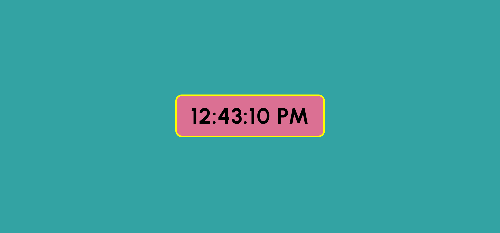

# ⏰ Digital Clock with Seconds

This project is a simple **Digital Clock** built using **HTML, CSS, and JavaScript**.  
It displays the **live current time with seconds** and updates automatically.

---

## 🚀 Features
- Shows **hours, minutes, and seconds** in real time  
- Updates every second to keep the clock running  
- Smooth display for most cases  
- ⏳ Note: The clock may sometimes stay **a second behind due to network or system delay**, but overall it works smoothly

---

## 📸 Preview
  

---

## ✨ Learning Note
This project helped me practice **DOM manipulation and time functions in JavaScript**, while also styling with CSS for a cleaner UI.

---
